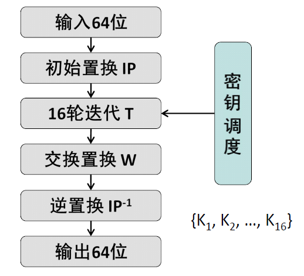
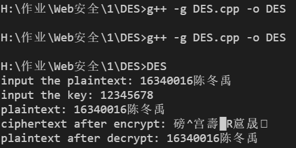

# DES
DES算法C++实现

[TOC]

## 算法原理概述

- DES是一种块加密方法，以64位为分组长度，输入64位明文，输出64位密文。
- DES使用加密密钥定义变换过程，因此算法认为只有持有加密所用的密钥的用户才能解密密文。
- DES 采用64位密钥，但由于每8位中的最后1位用于奇偶校验，实际有效密钥长度为56位。密钥可以是任意的56位的数，且可随时改变。其中极少量的数被认为是弱密钥，但能容易地避开它们。所有的保密性依赖于密钥。
- DES 算法的基本过程是换位和置换。

## 总体结构

- Feistel结构

  

- 输入64位明文M 时，子密钥按(K1K2 … K16)次序调度，是加密过程。

- 输入64位密文C 时，子密钥按(K16K15 … K1)次序调度，是解密过程。

## 模块分解

### 初始置换IP

```c++
int IP[64] = { 58, 50, 42, 34, 26, 18, 10, 2,
				60, 52, 44, 36, 28, 20, 12, 4,
				62, 54, 46, 38, 30, 22, 14, 6,
				64, 56, 48, 40, 32, 24, 16, 8,
				57, 49, 41, 33, 25, 17, 9, 1,
				59, 51, 43, 35, 27, 19, 11, 3,
				61, 53, 45, 37, 29, 21, 13, 5,
				63, 55, 47, 39, 31, 23, 15, 7 };
```


- 给定64位明文块M，通过一个固定的初始置换IP来重排M中的二进制位，得到二进制串M0 = IP(M) = L0R0，这里L0和R0分别是M0 的前32位和后32位。

### 迭代T

- 16次迭代

  

- 这里⊕是32位二进制串按位异或运算，f是输出32位的Feistel轮函数；

- 16个长度为48位的子密钥Ki (i = 1 .. 16) 由密钥K 生成；

- 16次迭代后得到L16R16 ；

- 左右交换输出R16L16 。

### 逆置换IP-1

```c++
int IP_1[64] = { 40, 8, 48, 16, 56, 24, 64, 32,
				39, 7, 47, 15, 55, 23, 63, 31,
				38, 6, 46, 14, 54, 22, 62, 30,
				37, 5, 45, 13, 53, 21, 61, 29,
				36, 4, 44, 12, 52, 20, 60, 28,
				35, 3, 43, 11, 51, 19, 59, 27,
				34, 2, 42, 10, 50, 18, 58, 26,
				33, 1, 41, 9, 49, 17, 57, 25 };
```


- 对迭代T 输出的二进制串R16L16使用初始置换的逆置换IP-1得到
  密文C，即：C = IP-1 (R16L16)。

### Feistel轮函数

- 将长度为32位的串Ri-1 作**E-扩展**，成为48位的串E(Ri-1)；

  - E-扩展规则

    ```c++
    int E[]	= { 32, 1, 2, 3, 4, 5,
    			4, 5, 6, 7, 8, 9,
    			8, 9, 10, 11, 12, 13,
    			12, 13, 14, 15, 16, 17,
    			16, 17, 18, 19, 20, 21,
    			20, 21, 22, 23, 24, 25,
    			24, 25, 26, 27, 28, 29,
    			28, 29, 30, 31, 32, 1 };
    ```

    

- 将E(Ri-1) 和长度为48位的**子密钥Ki** 作48位二进制串按位异或运算，Ki 由密钥K 生成；

  - 子密钥生成

    - 子密钥生成过程根据给定的64位密钥K，生成16个48位的子密钥K1-K16，供Feistel 轮函数f(Ri-1, Ki) 调用。

    - 对K 的56个非校验位实行置换PC-1，得到C0D0，其中C0 和D0分别由PC-1 置换后的前28位和后28位组成。

      - PC-1置换

        ```c++
        int PC_1[] = { 57, 49, 41, 33, 25, 17, 9,
        				1, 58, 50, 42, 34, 26, 18,
        				10, 2, 59, 51, 43, 35, 27,
        				19, 11, 3, 60, 52, 44, 36,
        				63, 55, 47, 39, 31, 23, 15,
        				7, 62, 54, 46, 38, 30, 22,
        				14, 6, 61, 53, 45, 37, 29,
        				21, 13, 5, 28, 20, 12, 4 };
        ```

      - 密钥K的8个校验位的下标不参与置换。

    - 计算Ci = LSi(Ci-1) 和Di = LSi(Di-1)

      -  当i =1, 2, 9, 16 时，LSi (A) 表示将二进制串A 循环左移一个位置；否则循环左移两个位置。

    - 对56位的CiDi 实行PC-2 压缩置换，得到48位的Ki 。i = i+1。

      - PC-2压缩置换

        ```c++
        int PC_2[] = { 14, 17, 11, 24, 1, 5,
        				3, 28, 15, 6, 21, 10,
        				23, 19, 12, 4, 26, 8,
        				16, 7, 27, 20, 13, 2,
        				41, 52, 31, 37, 47, 55,
        				30, 40, 51, 45, 33, 48,
        				44, 49, 39, 56, 34, 53,
        				46, 42, 50, 36, 29, 32 };
        ```

    - 如果已经得到K16，密钥调度过程结束；否则转(2)。

- 将(2) 得到的结果平均分成8个分组，每个分组长度6位。各个分组分别经过8个不同的**S-盒**进行6-4 转换，得到8个长度分别为4位的分组；

  - S-盒

    - S-盒是一类选择函数，用于二进制6-4 转换。Feistel 轮函数使用8个S-盒S1, …, S8，每个S-盒是一个4行(编号0-3)、16列(编号0-15) 的表，表中的每个元素是一个十进制数，取值在0-15之间，用于表示一个4位二进制数。

    - 假设Si 的6位输入为b1b2b3b4b5b6，则由n = (b1b6)10 确定行号，由m = (b2b3b4b5)10 确定列号，[Si]n,m 元素的值的二进制形式即为所要的Si 的输出。

    - S-盒S1-S8

      ```c++
      int S[8][4][16] = {
      	{
      		{ 14, 4, 13, 1, 2, 15, 11, 8, 3, 10, 6, 12, 5, 9, 0, 7 },
      		{ 0, 15, 7, 4, 15, 2, 13, 1, 10, 6, 12, 11, 9, 5, 3, 8 },
      		{ 4, 1, 14, 8, 13, 6, 2, 11, 15, 12, 9, 7, 3, 10, 5, 0 },
      		{ 15, 12, 8, 2, 4, 9, 1, 7, 5, 11, 3, 14, 10, 0, 6, 13 }
      	},{
      		{ 15, 1, 8, 14, 6, 11, 3, 4, 9, 7, 2, 13, 12, 0, 5, 10 },
      		{ 3, 13, 4, 7, 15, 2, 8, 14, 12, 0, 1, 10, 6, 9, 11, 5 },
      		{ 0, 14, 7, 11, 10, 4, 13, 1, 5, 8, 12, 6, 9, 3, 2, 15 },
      		{ 13, 8, 10, 1, 3, 15, 4, 2, 11, 6, 7, 12, 0, 5, 14, 9 }
      	},{
      		{ 10, 0, 9, 14, 6, 3, 15, 5, 1, 13, 12, 7, 11, 4, 2, 8 },
      		{ 13, 7, 0, 9, 3, 4, 6, 10, 2, 8, 5, 14, 12, 11, 15, 1 },
      		{ 13, 6, 4, 9, 8, 15, 3, 0, 11, 1, 2, 12, 5, 10, 14, 7 },
      		{ 1, 10, 13, 0, 6, 9, 8, 7, 4, 15, 14, 3, 11, 5, 2, 12 }
      	},{
      		{ 7, 13, 14, 3, 0, 6, 9, 10, 1, 2, 8, 5, 11, 12, 4, 15 },
      		{ 12, 8, 11, 5, 6, 15, 0, 3, 4, 7, 2, 12, 1, 10, 14, 9 },
      		{ 10, 6, 9, 0, 12, 11, 7, 13, 15, 1, 3, 14, 5, 2, 8, 4 },
      		{ 3, 15, 0, 6, 10, 1, 13, 8, 9, 4, 5, 11, 12, 7, 2, 14 }
      	},{
      		{ 2, 12, 4, 1, 7, 10, 11, 6, 8, 5, 3, 15, 13, 0, 14, 9 },
      		{ 14, 11, 2, 12, 4, 7, 13, 1, 5, 0, 15, 10, 3, 9, 8, 6 },
      		{ 4, 2, 1, 11, 10, 13, 7, 8, 15, 9, 12, 5, 6, 3, 0, 14 },
      		{ 11, 8, 12, 7, 1, 14, 2, 13, 6, 15, 0, 9, 10, 4, 5, 3 }
      	},{
      		{ 12, 1, 10, 15, 9, 2, 6, 8, 0, 13, 3, 4, 14, 7, 5, 11 },
      		{ 10, 15, 4, 2, 7, 12, 9, 5, 6, 1, 13, 14, 0, 11, 3, 8 },
      		{ 9, 14, 15, 5, 2, 8, 12, 3, 7, 0, 4, 10, 1, 13, 11, 6 },
      		{ 4, 3, 2, 12, 9, 5, 15, 10, 11, 14, 1, 7, 6, 0, 8, 13 }
      	},{
      		{ 4, 11, 2, 14, 15, 0, 8, 13, 3, 12, 9, 7, 5, 10, 6, 1 },
      		{ 13, 0, 11, 7, 4, 9, 1, 10, 14, 3, 5, 12, 2, 15, 8, 6 },
      		{ 1, 4, 11, 13, 12, 3, 7, 14, 10, 15, 6, 8, 0, 5, 9, 2 },
      		{ 6, 11, 13, 8, 1, 4, 10, 7, 9, 5, 0, 15, 14, 2, 3, 12 }
      	},{
      		{ 13, 2, 8, 4, 6, 15, 11, 1, 10, 9, 3, 14, 5, 0, 12, 7 },
      		{ 1, 15, 13, 8, 10, 3, 7, 4, 12, 5, 6, 11, 0, 14, 9, 2 },
      		{ 7, 11, 4, 1, 9, 12, 14, 2, 0, 6, 10, 13, 15, 3, 5, 8 },
      		{ 2, 1, 14, 7, 4, 10, 8, 13, 15, 12, 9, 0, 3, 5, 6, 11 }
      	}
      };
      ```

      

- 将(3) 得到的分组结果顺序连接得到长度为32位的串；

- 将(4) 的结果经过**P-置换**，得到的结果作为轮函数f(Ri-1, Ki) 的最终32位输出。

  - P-置换

  ```c++
  int P[] = { 16, 7, 20, 21,
  			29, 12, 28, 17,
  			1, 15, 23, 26,
  			5, 18, 31, 10,
  			2, 8, 24, 14,
  			32, 27, 3, 9,
  			19, 13, 30, 6,
  			22, 11, 4, 25 };
  ```

### DES解密

- DES 的加密和解密可使用相同的算法和密钥。
- 解密过程的子密钥按(K16 K15 … K2 K1) 次序调度

## C++源代码

https://github.com/hathcdy/DES

## 编译运行结果




​	

